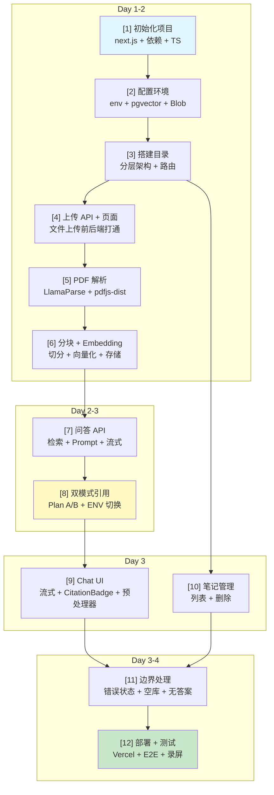

# 开发流程 + 验收清单

## 依赖关系图



---

## [1] 初始化 Next.js 项目 + 安装依赖 + 配置 TypeScript/ESLint

**产出**：可启动的 Next.js 项目骨架

| # | 验收项 | 验证方式 |
|---|--------|---------|
| 1.1 | 项目可启动 | `npm run dev` → 浏览器打开 `localhost:3000` 看到 Next.js 默认页 |
| 1.2 | TypeScript 生效 | 写一个类型错误 → 编辑器标红 + `npm run build` 报错 |
| 1.3 | 关键依赖安装成功 | `node_modules` 中存在：`ai`、`react-markdown`、`rehype-raw`、`pdfjs-dist`、`@vercel/postgres`、`@vercel/blob` |

---

## [2] 配置环境变量 + Vercel Postgres (pgvector) 建表 + Vercel Blob 存储

**产出**：基础设施就绪，数据库和存储可用

| # | 验收项 | 验证方式 |
|---|--------|---------|
| 2.1 | 环境变量可读 | 写一个 API 路由 `return Response.json({ db: !!process.env.POSTGRES_URL })` → 返回 `true` |
| 2.2 | pgvector 扩展已启用 | `SELECT * FROM pg_extension WHERE extname='vector'` → 有记录 |
| 2.3 | notes / chunks 表已建 | `\dt` 列出 `notes` 和 `chunks` 两张表 |
| 2.4 | Blob 上传可通 | 写一个测试脚本上传 1KB 文本文件 → 返回 blob URL，浏览器可访问 |

---

## [3] 搭建项目目录结构（约定式路由 + 分层架构）

**产出**：清晰的目录骨架，所有模块文件已占位

```
src/
├── app/
│   ├── page.tsx              # 首页（Chat 页面）
│   ├── upload/page.tsx       # 上传页面
│   ├── notes/page.tsx        # 笔记管理页面
│   └── api/
│       ├── upload/route.ts   # 上传 API
│       ├── chat/route.ts     # 问答 API
│       └── notes/route.ts    # 笔记 CRUD API
├── lib/
│   ├── db.ts                 # pgvector 客户端
│   ├── blob.ts               # Vercel Blob 客户端
│   ├── parser.ts             # 文档解析（LlamaParse + 降级）
│   ├── chunker.ts            # 文本分块
│   ├── embed.ts              # Embedding 调用
│   ├── retrieve.ts           # 向量检索
│   └── citation.ts           # 引用格式生成（双模式）
└── components/
    ├── ChatInput.tsx
    ├── ChatMessage.tsx
    ├── CitationBadge.tsx      # 引用标签组件
    ├── FileUpload.tsx
    └── NoteList.tsx
```

| # | 验收项 | 验证方式 |
|---|--------|---------|
| 3.1 | 所有路由可访问 | 访问 `/` `/upload` `/notes` → 返回 200（即使是空白页） |
| 3.2 | 所有 API 路由已注册 | 访问 `/api/upload` `/api/chat` `/api/notes` → 返回 200/405（不是 404） |
| 3.3 | lib 模块可 import | 在任一 API 路由中 `import { ... } from '@/lib/...'` → 编译不报错 |

---

## [4] 实现文件上传 API（/api/upload）+ 前端上传页面

**产出**：用户可在页面上传 .md / .txt / .pdf 文件，后端接收并存储到 Blob

| # | 验收项 | 验证方式 |
|---|--------|---------|
| 4.1 | 拖拽/点击上传可用 | 打开 `/upload`，拖入一个 .md 文件 → 显示"上传成功" |
| 4.2 | 后端接收文件 | 上传后检查 Vercel Blob → 文件存在，内容与原文件一致 |
| 4.3 | 文件格式校验 | 上传一个 .jpg → 返回错误提示"不支持的文件格式" |
| 4.4 | 文件大小限制 | 上传一个 15MB 文件 → 返回错误提示"文件过大" |

---

## [5] 实现 PDF 解析模块（LlamaParse 主线 + pdfjs-dist 降级）

**产出**：PDF 文件上传后能提取出结构化 Markdown 文本

| # | 验收项 | 验证方式 |
|---|--------|---------|
| 5.1 | LlamaParse 正常返回 | 上传一个规范 PDF → 日志显示从 LlamaParse 获得 Markdown 文本 |
| 5.2 | Markdown 结构完整 | 返回的文本包含 `#` 标题、`-` 列表、表格 `|` 等 Markdown 语法 |
| 5.3 | 降级触发正常 | 临时改错 LlamaParse API key → 上传 PDF → 走 pdfjs-dist 降级 → 前端显示"解析质量可能受影响"但上传不阻塞 |
| 5.4 | .md / .txt 跳过 API | 上传一个 .md 文件 → 日志显示直接读取，未调用 LlamaParse |
| 5.5 | 中文 PDF 可解析 | 上传含中文的 PDF → 返回文本中文无乱码 |

---

## [6] 实现文本分块 (chunking) + Embedding + pgvector 存储

**产出**：上传笔记后，内容被分块、向量化并存入数据库

| # | 验收项 | 验证方式 |
|---|--------|---------|
| 6.1 | 分块正确 | 上传一篇 3000 字的笔记 → 在数据库中查到 3-4 个 chunk，每个 800-1200 字符 |
| 6.2 | 重叠生效 | 相邻 chunk 的后 100 字符 = 下一个 chunk 的前 100 字符 |
| 6.3 | Markdown 语义分块 | 笔记含 `## 第一章` `## 第二章` → chunk 不跨标题边界 |
| 6.4 | Embedding 生成成功 | 查看 chunks 表的 `embedding` 列 → 1536 维向量数组，非 NULL |
| 6.5 | 向量可检索 | `SELECT * FROM chunks ORDER BY embedding <=> query_embedding LIMIT 5` → 返回结果 |

---

## [7] 实现问答 API（/api/chat）：向量检索 + Prompt 组装 + LLM 流式生成

**产出**：`POST /api/chat` 可接收问题，返回流式回答

| # | 验收项 | 验证方式 |
|---|--------|---------|
| 7.1 | 检索返回相关 chunk | 导入一篇"深度学习笔记"，问"什么是 Transformer" → 检索日志显示相关 chunk 被召回 |
| 7.2 | LLM 流式输出 | `curl -N POST /api/chat -d '{"question":"...?"}'` → 逐 token 流式返回 |
| 7.3 | 基于笔记回答 | 回答内容与笔记一致，未编造笔记中不存在的信息 |
| 7.4 | 无答案诚实告知 | 问一个笔记中不存在的话题 → 回答含"未找到相关信息" |
| 7.5 | 空笔记库处理 | 未导入任何笔记时提问 → 返回"请先导入笔记" |

---

## [8] 实现双模式引用体系（Plan A 全文引用 + Plan B 轻量引用，CITATION_MODE 切换）

**产出**：LLM 按引用格式输出，环境变量控制格式

| # | 验收项 | 验证方式 |
|---|--------|---------|
| 8.1 | CITATION_MODE=full 时输出完整引用 | LLM 输出含 `<cite id="3" text="原文..."/>` |
| 8.2 | CITATION_MODE=light 时输出轻量引用 | LLM 输出含 `<cite id="3" />`（自闭合，无 text） |
| 8.3 | 引用编号与 chunk 一致 | 回答中 `id="3"` 在 chunks 表中存在，且内容相关 |
| 8.4 | 不编造引用 | 人工抽查 5 个引用 → id 对应的 chunk 确实包含支持该声明的文字 |

---

## [9] 前端 Chat UI：流式渲染 + rehype-raw + CitationBadge 组件 + 流式预处理器

**产出**：完整的对话界面，引用可点击高亮

| # | 验收项 | 验证方式 |
|---|--------|---------|
| 9.1 | 流式打字效果 | 提问后回答逐字出现（非一次性加载） |
| 9.2 | `<cite>` 标签渲染为 CitationBadge | 回答中看到可点击的引用标签（如 `[来源3]`），不是原始 XML 文本 |
| 9.3 | 点击引用弹出原文 | 点击 `[来源3]` → 弹窗/侧栏显示对应 chunk 原文 |
| 9.4 | Plan A 精准高亮 | 弹窗中引用的原文句子被高亮标注 |
| 9.5 | 流式截断不崩溃 | 在回答生成过程中观察 → 页面无白屏/闪退，标签始终可渲染 |
| 9.6 | XSS 安全 | 上传含 `<script>alert(1)</script>` 的笔记 → 文本被转义，不弹窗 |

---

## [10] 笔记管理页面（列表 + 删除）

**产出**：`/notes` 页面可查看和删除已导入笔记

| # | 验收项 | 验证方式 |
|---|--------|---------|
| 10.1 | 列表正确 | 导入 3 篇笔记后访问 `/notes` → 显示 3 条记录（文件名 + 导入时间） |
| 10.2 | 删除笔记 | 点击删除 → 笔记消失 → 再次提问相关问题 → 不再召回该笔记内容 |
| 10.3 | 向量同步清除 | 删除笔记后查 chunks 表 → 该 note_id 的 chunk 全部删除 |
| 10.4 | 空列表提示 | 删除全部笔记 → 页面显示"暂无笔记，去导入吧" |

---

## [11] 边界情况处理 + 错误状态 UI

**产出**：各种异常场景有友好提示

| # | 验收项 | 验证方式 |
|---|--------|---------|
| 11.1 | API 超时 | 断开网络后提问 → 显示"网络异常，请检查连接"而不是白屏 |
| 11.2 | LLM API key 失效 | 临时改错 API key → 提问时显示"AI 服务暂时不可用" |
| 11.3 | 超大文件 | 上传 20MB 文件 → 前端拦截并提示，不发起请求 |
| 11.4 | PDF 解析失败 | 上传损坏的 PDF → 显示"解析失败，请检查文件是否完整" |
| 11.5 | 并发上传 | 同时拖入 5 个文件 → 逐个处理成功，不丢文件不混乱 |
| 11.6 | 笔记中无答案 | 问不相关的问题 → 回答以"根据你的笔记"开头，不编造 |

---

## [12] 部署 Vercel + 端到端测试 + 录屏演示

**产出**：生产环境可访问的 URL + 演示视频

| # | 验收项 | 验证方式 |
|---|--------|---------|
| 12.1 | Vercel 部署成功 | 访问生产 URL → 页面正常加载 |
| 12.2 | 完整流程走通 | 生产环境：上传笔记 → 提问 → 查看引用 → 无答案场景 → 全流程无报错 |
| 12.3 | 录屏演示 | 视频包含：导入笔记 / 提问并查看溯源 / 问一个笔记中没有答案的问题 |
| 12.4 | README 完整 | 三个部分各 ≤250 字，说清构建了什么、没构建了什么、多 3 天做什么 |

---

## 步骤依赖关系

```
[1] 初始化
 └── [2] 配置环境
      └── [3] 搭建目录
           ├── [4] 上传 API+页面 ──→ [5] PDF 解析
           │                           └── [6] 分块+Embedding
           │                                 └── [7] 问答 API
           │                                       ├── [8] 双模式引用
           │                                       └── [9] Chat UI
           └── [10] 笔记管理

[7]+[8]+[9]+[10] 都完成后 ──→ [11] 边界处理 ──→ [12] 部署+测试
```

---

# 第二阶段：体验优化

## [O1] 批量上传 + 全局拖拽

**产出**：用户可一次框选/拖入多个文件，串行上传，逐个展示结果

| # | 验收项 | 验证方式 |
|---|--------|---------|
| O1.1 | 多选上传 | input multiple → 选 3 个文件 → 列表显示 3 条 |
| O1.2 | 拖拽多文件 | 从文件夹拖 N 个文件到上传区 → 松开即开始 |
| O1.3 | 拖拽视觉反馈 | 拖入时蓝色边框 + 放大 + "松开即可上传" |
| O1.4 | 串行不并发 | 列表逐个处理，不会同时打爆 API |
| O1.5 | 失败不阻塞 | ❌ 的那条不影响后面继续 |
| O1.6 | 快速连续拖入安全 | UUID 防闭包索引错乱 |

## [O2] 侧边栏折叠导航

**产出**：左侧可折叠导航栏，替代顶栏，释放横向空间

| # | 验收项 | 验证方式 |
|---|--------|---------|
| O2.1 | 折叠/展开 | 点击 ▶/◀ 按钮，侧边栏在 56px ↔ 200px 切换 |
| O2.2 | 路由高亮 | 切换页面时对应导航项变蓝 |
| O2.3 | 全局挂载 | 路由切换时侧边栏不闪烁不重载 |
| O2.4 | 移动端降级 | 窄屏默认折叠，点击遮罩关闭 |
| O2.5 | 旧 NavBar 全删 | 三个页面无顶栏残留 |

## [O3] 笔记分类系统

**产出**：文件夹分组管理笔记，不影响全局检索

| # | 验收项 | 验证方式 |
|---|--------|---------|
| O3.1 | 分组显示 | /notes 页面按 folder 折叠分组 |
| O3.2 | 新建文件夹 | 下拉选"＋ 新建..." → 输入名称 → 回车 → 笔记移入新分组 |
| O3.3 | 移动到已有文件夹 | 下拉选已有文件夹名 → 即时移动 |
| O3.4 | 检索不受影响 | 提问仍能召回所有分类的笔记 |
| O3.5 | 空文件夹不显示 | 无笔记的文件夹不出现在列表 |

## [O4] 文件级进度指示器

**产出**：批量上传时每个文件显示独立状态

| # | 验收项 | 验证方式 |
|---|--------|---------|
| O4.1 | 状态切换 | pending(⏳) → uploading(⏳脉冲) → done(✅) / error(❌) |
| O4.2 | 整体进度 | "进度：2/5" 实时更新 |
| O4.3 | 清除已完成 | 点"清除"按钮移除单条 |

---

## 步骤依赖关系（含优化）

```
[1] 初始化
 └── [2] 配置环境
      └── [3] 搭建目录
           ├── [4] 上传 API+页面 ──→ [5] PDF 解析
           │                           └── [6] 分块+Embedding
           │                                 └── [7] 问答 API
           │                                       ├── [8] 双模式引用
           │                                       └── [9] Chat UI
           ├── [10] 笔记管理
           └── [11] 边界处理

[1]~[12] 主线完成 → 体验优化:
  [O1] 批量上传+拖拽 ──→ [O4] 进度指示器
  [O2] 侧边栏导航    ──→ 独立不影响其他
  [O3] 笔记分类系统  ──→ 独立，需后端 PATCH
```
